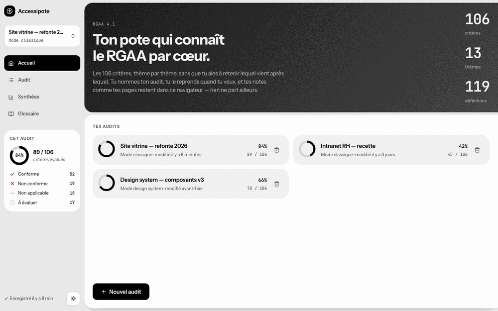
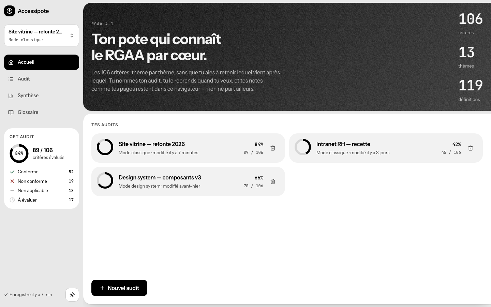
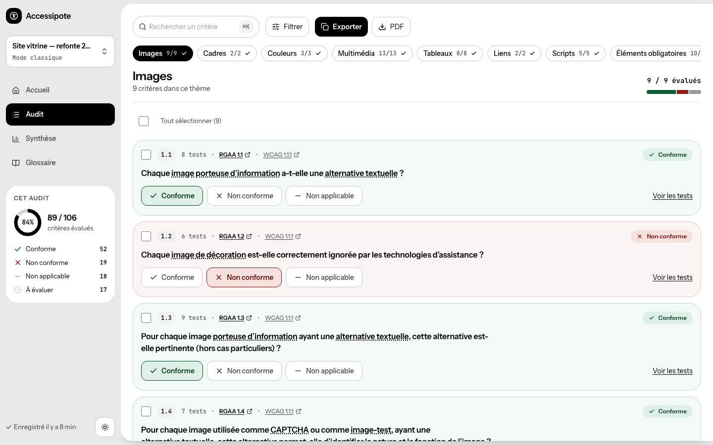
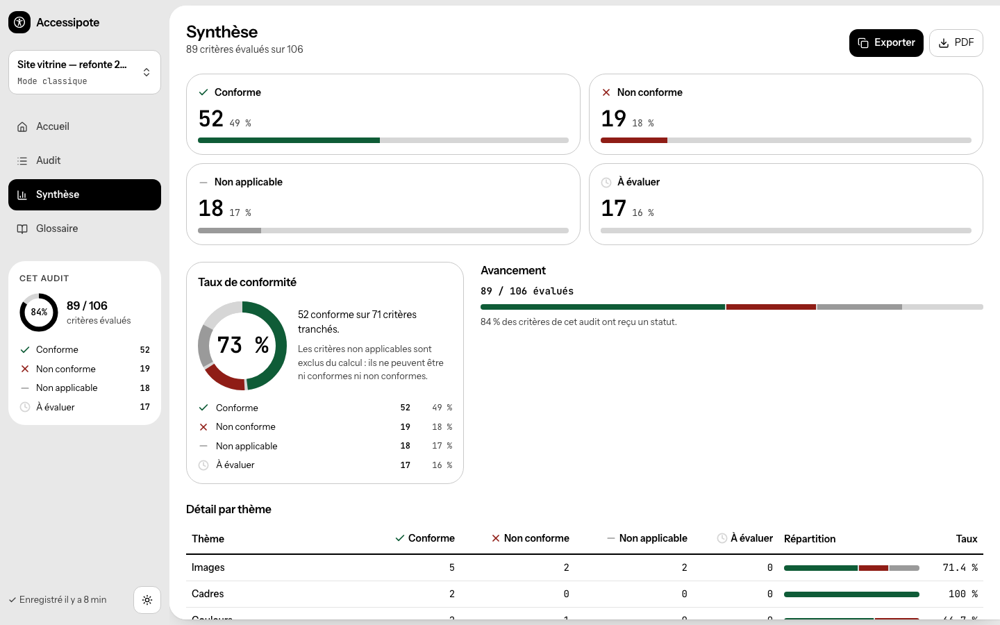
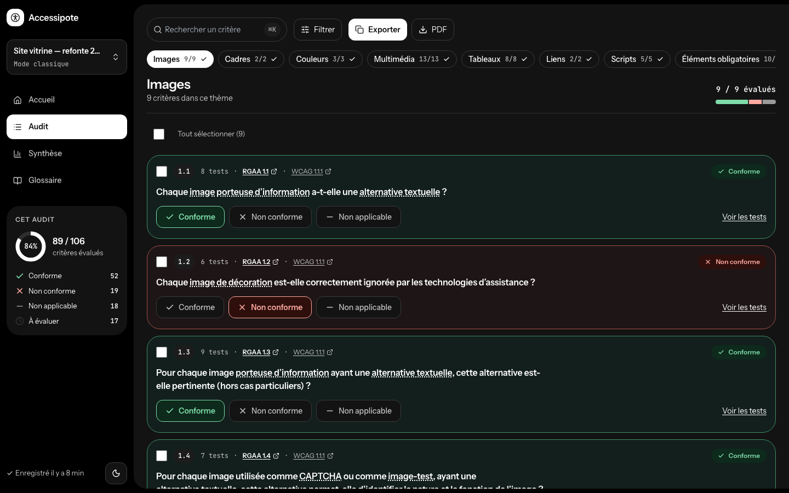

<div align="center">


# Accessipote

**L'audit RGAA 4.1 sans tableur.** Les 106 critères d'accessibilité numérique,
thème par thème, avec vos notes, vos pages et votre taux de conformité — le tout
dans votre navigateur, sans compte et sans serveur.

[**→ Ouvrir l'application**](https://accessipote.fr)

[](https://github.com/samuelboulery/accessipote/actions/workflows/ci.yml)
[](#tests-et-qualité)
[](#tests-et-qualité)
[](LICENSE)
[](https://accessibilite.numerique.gouv.fr/)



</div>

---

## Le problème

Un audit RGAA se mène encore, le plus souvent, dans un tableur. 106 critères,
13 thèmes, une colonne par statut, une autre pour les notes, et le calcul du
taux de conformité fait à la main — en oubliant régulièrement que « non
applicable » ne compte pas au dénominateur.

Puis le site évolue. Il faut reprendre l'audit, retrouver où on en était, et
comprendre ce que voulait dire la note laissée trois mois plus tôt.

Accessipote fait exactement ce travail, et rien d'autre.

## Ce que fait l'outil

**Des audits nommés et reprenables.** Un audit se crée, se date, se rouvre. Le
mode est figé à sa création — *Classique* pour un audit de site, *Design
System* pour évaluer un système de composants, avec ses propres statuts
(« conforme par défaut », « à mettre en place »).

**Un thème à la fois.** Le thème n'est pas un filtre posé sur une liste de 106
lignes : c'est la navigation elle-même. On traite les Images, puis les Liens,
puis les Formulaires.

**Tout ce qu'un critère demande.** Pour chacun : son statut, ses tests
cochables un par un, une note libre, et la liste des pages concernées. Les
références WCAG 2.1 et les techniques W3C sont liées, les termes du référentiel
renvoient au glossaire d'un clic.

**Une synthèse qui ne triche pas.** Taux de conformité, anneau de progression,
jauge par statut, tableau par thème. « Évalués » et « tranchés » sont deux
compteurs distincts, avec deux dénominateurs différents — parce que ce sont
deux questions différentes.

**Un rapport exportable.** En Markdown, copié dans le presse-papiers pour
tomber directement dans un ticket ou un compte rendu ; en PDF pour être envoyé
tel quel.

**Un glossaire de 119 entrées**, consultable en plein écran ou en survol depuis
un critère.

## Captures

|  |  |
|---|---|
|  |  |
| **Accueil** — vos audits, leur avancement | **Audit** — un thème, ses critères, vos notes |
|  |  |
| **Synthèse** — conformité et répartition | **Mode sombre** — comme le reste, au clavier |

## Démarrage

Prérequis : **Node 20 ou plus**. Le gestionnaire de paquets est **pnpm**, dont
la version est figée par le champ `packageManager`.

```bash
git clone https://github.com/samuelboulery/accessipote.git
cd accessipote
corepack enable
pnpm install
pnpm dev            # http://localhost:5173
```

Pour un déploiement, `pnpm build` produit un dossier `dist/` statique qui se
sert depuis n'importe quel hébergeur. Il n'y a rien à configurer : pas de
variable d'environnement, pas de base de données, pas d'API.

## Ce qui distingue l'outil

### Vos données ne bougent pas

Il n'y a pas de serveur. Les audits vivent dans le `localStorage` de votre
navigateur, et la politique de sécurité de contenu déclare `connect-src 'self'`
— l'application est structurellement incapable d'envoyer quoi que ce soit
ailleurs. Pas de compte à créer, pas de traceur, pas de conditions d'utilisation
à accepter.

C'est aussi la limite à connaître : vider les données du navigateur efface les
audits. L'export sert autant de sauvegarde que de livrable.

### Le référentiel officiel, non retouché

Les 106 critères et les 119 entrées du glossaire proviennent du RGAA 4.1 publié
par la DINUM, repris **sans modification**. C'est une règle du dépôt, pas une
intention : un outil d'audit qui altérerait le référentiel qu'il mesure ne
vaudrait rien. Voir [NOTICE.md](NOTICE.md).

### L'outil applique ce qu'il mesure

Un outil d'audit d'accessibilité inaccessible serait une plaisanterie. Ce qui
est en place, et vérifié par des tests :

- **Aucune information par la couleur seule.** Chaque statut porte une icône de
  forme distincte et un libellé. La source est unique :
  [`src/utils/statusPresentation.ts`](src/utils/statusPresentation.ts).
- **Cibles d'au moins 44 × 44 px.** Un contrôle de 40 px porte la classe
  `target-44`, qui étend sa zone cliquable par un pseudo-élément.
- **Tailles en `rem`, jamais en `px`** : le zoom texte du navigateur agit
  réellement sur l'interface (critère RGAA 10.4).
- **Anneaux de focus à double contraste**, visibles sur fond clair comme sur
  fond sombre.
- **`prefers-reduced-motion` et `prefers-contrast: more`** respectés.
- **Navigation entièrement au clavier**, avec des raccourcis et leur modale
  d'aide.

### Une CSP qu'on n'a pas eu à assouplir

`index.html` déclare une politique de sécurité de contenu sans `unsafe-inline`
ni `unsafe-eval`. Les polices sont auto-hébergées : aucune requête vers Google
Fonts ni vers un CDN. En développement, un greffon Vite relâche la CSP le temps
du rechargement à chaud, et uniquement là.

## Stack

| Couche | Technologie |
|---|---|
| Interface | React 19, TypeScript 5.9 en mode strict |
| Build | Vite 7 |
| Styles | Tailwind CSS 3, échelle restreinte aux jetons du design |
| Icônes | Lucide React |
| Export PDF | jsPDF + jspdf-autotable, chargés à la demande |
| Assainissement | DOMPurify |
| Tests | Vitest, Testing Library |
| Persistance | `localStorage` |

L'échelle Tailwind par défaut est **remplacée** par celle du design : une classe
hors système ne produit aucun style. C'est volontaire — les dérives se voient
tout de suite.

Le chargement initial pèse environ **162 kB compressés**. Les 230 kB de la
chaîne PDF ne sont téléchargés qu'au moment où l'on exporte.

## Architecture

```
src/
├── components/   Composants React, un fichier par unité d'interface
├── hooks/        État et effets : audits, filtres, progression, thème, clavier
├── utils/        Fonctions pures : export, calculs de synthèse, parsing, migration
├── data/         criteria.json, glossary.json, wcag-anchors.json (données RGAA)
├── types/        Source de vérité des types partagés
├── tokens.css    Jetons de couleur, typographie, rayons, anneaux de focus
└── App.tsx       Quatre destinations : Accueil, Audit, Synthèse, Glossaire
```

Deux endroits font autorité et méritent d'être connus avant de contribuer :
[`statusPresentation.ts`](src/utils/statusPresentation.ts) pour tout ce qui
touche à l'affichage d'un statut, et
[`summaryView.ts`](src/utils/summaryView.ts) pour les compteurs de la synthèse.

## Tests et qualité

**629 tests** répartis sur 46 fichiers, **97 % de couverture** en lignes et
90 % en branches. La CI les rejoue sur Node 20 et 22 à chaque poussée.

```bash
pnpm test          # mode surveillance
pnpm test:run      # une passe, comme la CI
pnpm test:coverage # rapport de couverture
pnpm lint
pnpm build
```

## Contribuer

Les contributions sont bienvenues — ouvrez une issue avant d'écrire du code, ça
évite les allers-retours. Tout est dans [CONTRIBUTING.md](CONTRIBUTING.md) :
mise en route, conventions, et la barre d'accessibilité, qui est plus haute ici
qu'ailleurs.

Pour une faille de sécurité, ne passez pas par une issue publique :
[SECURITY.md](SECURITY.md).

## Licence

Le code est sous [licence MIT](LICENSE).

Les données du RGAA 4.1 sont publiées par la DINUM sous
[Licence Ouverte 2.0](https://www.etalab.gouv.fr/licence-ouverte-open-licence/).
Le détail des licences — données, références WCAG, polices — est dans
[NOTICE.md](NOTICE.md).

---

<div align="center">
<sub>Accessipote n'est pas un outil officiel de la DINUM. Il s'appuie sur le
référentiel qu'elle publie.</sub>
</div>
