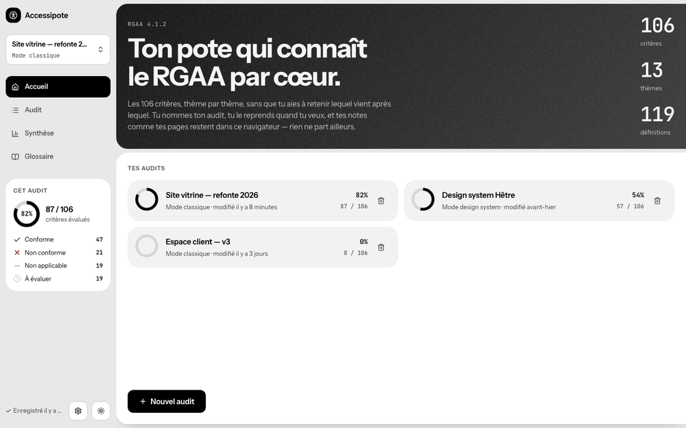
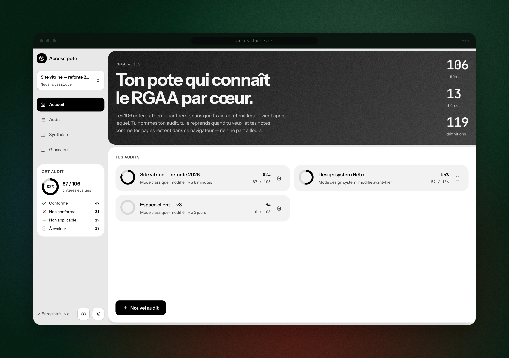
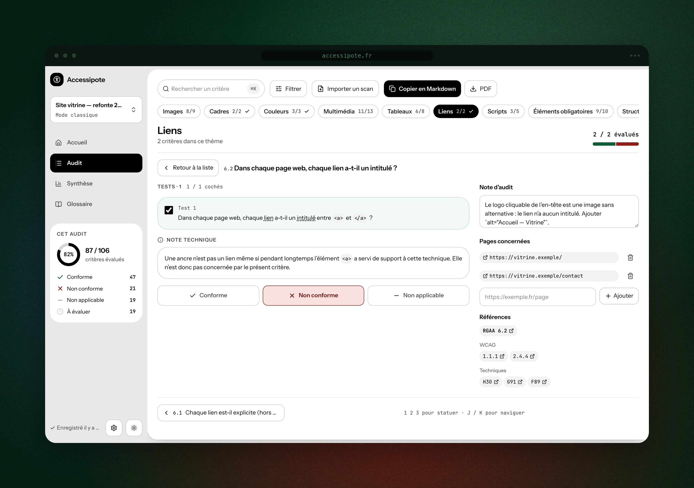
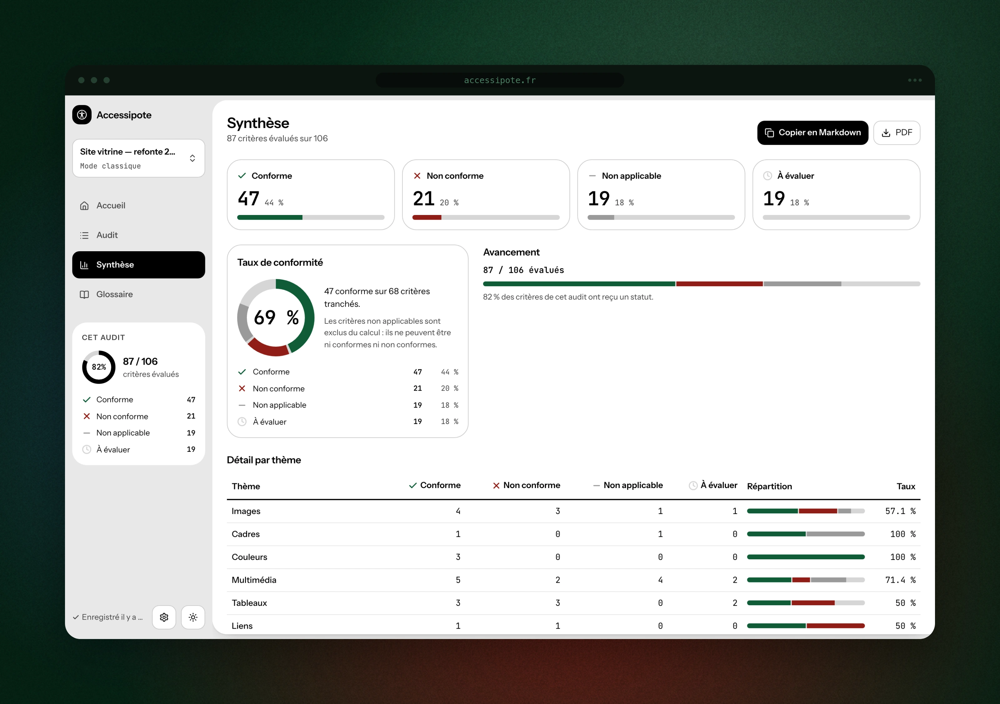
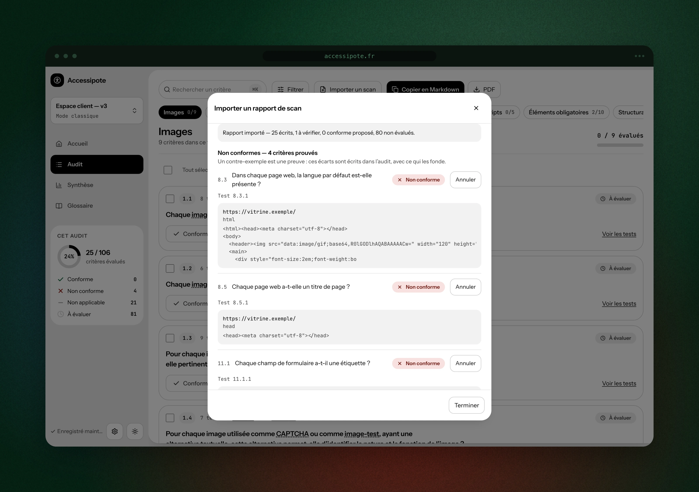
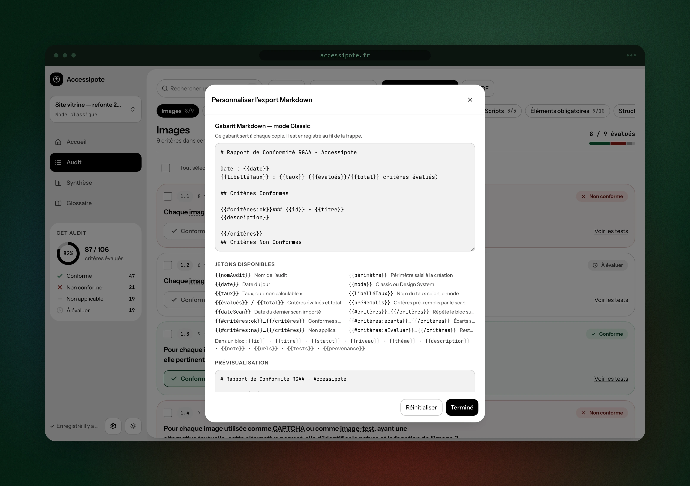
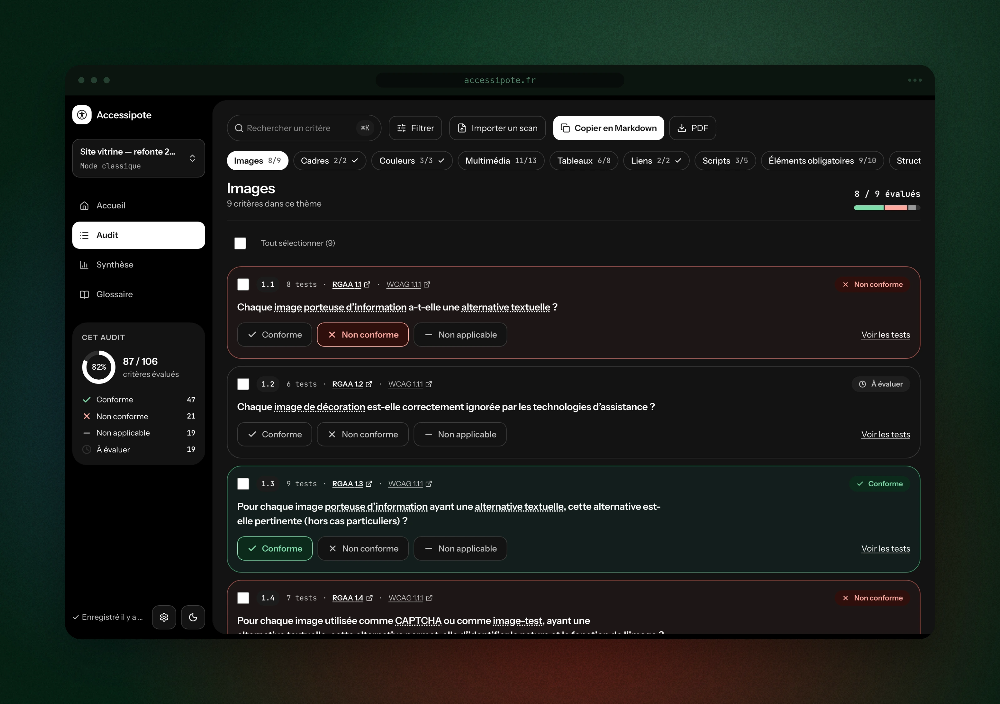

<div align="center">


# Accessipote

**L'audit RGAA 4.1.2 sans tableur.** Les 106 critères d'accessibilité numérique,
thème par thème, avec vos notes, vos pages et votre taux de conformité — le tout
dans votre navigateur, sans compte et sans serveur.

[**→ Ouvrir l'application**](https://accessipote.fr)

[](https://github.com/samuelboulery/accessipote/actions/workflows/ci.yml)
[](#tests-et-qualité)
[](#tests-et-qualité)
[](LICENSE)
[](https://accessibilite.numerique.gouv.fr/)



</div>

---

## Le problème

Un audit RGAA se mène encore, le plus souvent, dans un tableur. 106 critères,
13 thèmes, une colonne par statut, une autre pour les notes, et le calcul du
taux de conformité fait à la main — en oubliant régulièrement que « non
applicable » ne compte pas au dénominateur.

Puis le site évolue. Il faut reprendre l'audit, retrouver où on en était, et
comprendre ce que voulait dire la note laissée trois mois plus tôt.

Accessipote fait exactement ce travail, et rien d'autre.

## Ce que fait l'outil

**Des audits nommés et reprenables.** Un audit se crée, se date, se rouvre. Le
mode est figé à sa création — *Classique* pour un audit de site, *Design
System* pour évaluer un système de composants, avec ses propres statuts
(« conforme par défaut », « à mettre en place »).

**Un thème à la fois.** Le thème n'est pas un filtre posé sur une liste de 106
lignes : c'est la navigation elle-même. On traite les Images, puis les Liens,
puis les Formulaires.

**Tout ce qu'un critère demande.** Pour chacun : son statut, ses tests
cochables un par un, une note libre, et la liste des pages concernées. Les cas
particuliers et les notes techniques du référentiel s'affichent sous les tests.
Les références WCAG 2.1 et les techniques W3C sont liées, les termes du
référentiel renvoient au glossaire d'un clic.

**Un scan automatique pour dégrossir.** axe-core et une sonde DOM passent sur
un échantillon de pages, et le rapport s'importe dans un audit classique. Le
partage des rôles est strict : seuls les non conformes et les non applicables
*prouvés* sont écrits d'office ; un écart seulement probable est proposé à
vérifier, un conforme attend toujours votre confirmation, et ce que le scan n'a
pas su regarder reste à évaluer — compté à l'écran. Chaque statut posé par le
scan garde sa provenance, jusque dans les exports, et ce que vous avez tranché
vous-même n'est jamais écrasé. Le scan se lance en ligne de commande ou depuis
une [extension Chrome](#scan-automatique-facultatif), qui sait aussi scanner une
zone de page ou parcourir un site.

**Une synthèse qui ne triche pas.** Taux de conformité, anneau de progression,
jauge par statut, tableau par thème. « Évalués » et « tranchés » sont deux
compteurs distincts, avec deux dénominateurs différents — parce que ce sont
deux questions différentes.

**Un rapport exportable.** En Markdown, copié dans le presse-papiers pour
tomber directement dans un ticket ou un compte rendu — depuis un gabarit que
vous réécrivez à votre goût, avec ses jetons et sa prévisualisation ; en PDF,
aux couleurs de l'application, pour être envoyé tel quel.

**Un glossaire de 119 entrées**, consultable en plein écran ou en survol depuis
un critère.

## Captures

|  |  |
|---|---|
|  |  |
| **Accueil** — vos audits, leur avancement | **Audit** — un critère, ses tests, vos notes |
|  |  |
| **Synthèse** — conformité et répartition | **Import de scan** — ce qui est prouvé, ce qui reste à voir |
|  |  |
| **Gabarit d'export** — votre rapport, votre format | **Mode sombre** — comme le reste, au clavier |

Les captures se régénèrent avec `node scripts/screenshots.mjs` sur un audit de
démonstration à date fixe ; voir l'en-tête du script.

## Démarrage

Prérequis : **Node 22.22 ou plus**. Le gestionnaire de paquets est **pnpm**, dont
la version est figée par le champ `packageManager`.

```bash
git clone https://github.com/samuelboulery/accessipote.git
cd accessipote
corepack enable
pnpm install
pnpm dev            # http://localhost:5173
```

Pour un déploiement, `pnpm build` produit un dossier `dist/` statique qui se
sert depuis n'importe quel hébergeur. Il n'y a rien à configurer : pas de
variable d'environnement, pas de base de données, pas d'API.

### Scan automatique (facultatif)

En ligne de commande, le scan pilote un Chromium installé par Playwright :

```bash
pnpm exec playwright install chromium   # une fois
pnpm scan -o rapport.json https://exemple.fr https://exemple.fr/contact
```

Le rapport s'importe ensuite depuis un audit classique, bouton « Importer un
scan ».

L'extension Chrome évite le terminal : elle scanne la page ouverte — y compris
derrière une connexion —, une zone choisie à la souris, ou un site parcouru
pour vous (même origine, `robots.txt` respecté, limites explicites), et envoie
le lot directement dans l'onglet Accessipote. Elle n'est pas publiée sur le
Chrome Web Store ; elle se charge depuis les sources :

```bash
pnpm build:extension
```

Puis `chrome://extensions` → mode développeur → « Charger l'extension non
empaquetée » → dossier `dist-extension/`. Le détail — panier d'échantillon,
scan de zone, crawl — est dans [extension/README.md](extension/README.md).

## Ce qui distingue l'outil

### Vos données ne bougent pas

Il n'y a pas de serveur. Les audits vivent dans le `localStorage` de votre
navigateur, et la politique de sécurité de contenu n'autorise aucune destination
réseau qui puisse les recevoir — l'application est structurellement incapable
d'envoyer votre travail ailleurs. Pas de compte à créer, pas de conditions
d'utilisation à accepter.

La seule exception est la mesure d'audience du site publié sur
[accessipote.fr](https://accessipote.fr) : Cloudflare Web Analytics compte les
pages vues, sans cookie, sans stockage sur votre poste et sans empreinte de
navigateur. Elle relève à ce titre de l'exemption de consentement de la CNIL, ce
qui explique l'absence de bandeau. Elle ne voit rien de vos audits. Une instance
que vous hébergez vous-même n'a qu'à retirer la balise `beacon.min.js` en bas
d'`index.html` — et les deux domaines Cloudflare de la CSP.

Le scan suit la même règle. La CLI écrit un fichier sur votre poste ;
l'extension remet son rapport à l'onglet Accessipote ouvert, sans serveur
intermédiaire. Les seules requêtes qu'elle émet sont celles du crawl, vers le
site que vous lui avez demandé de parcourir. Dans les deux cas, l'application
revalide le rapport reçu comme n'importe quel fichier venu du dehors.

C'est aussi la limite à connaître : vider les données du navigateur efface les
audits. L'export sert autant de sauvegarde que de livrable.

### Le référentiel officiel, non retouché

Les 106 critères et les 119 entrées du glossaire proviennent du RGAA 4.1.2 publié
par la DINUM, repris **sans modification**. C'est une règle du dépôt, pas une
intention : un outil d'audit qui altérerait le référentiel qu'il mesure ne
vaudrait rien. Voir [NOTICE.md](NOTICE.md).

### L'outil applique ce qu'il mesure

Un outil d'audit d'accessibilité inaccessible serait une plaisanterie. Ce qui
est en place, et vérifié par des tests :

- **Aucune information par la couleur seule.** Chaque statut porte une icône de
  forme distincte et un libellé. La source est unique :
  [`src/utils/statusPresentation.ts`](src/utils/statusPresentation.ts).
- **Cibles d'au moins 44 × 44 px.** Un contrôle de 40 px porte la classe
  `target-44`, qui étend sa zone cliquable par un pseudo-élément.
- **Tailles en `rem`, jamais en `px`** : le zoom texte du navigateur agit
  réellement sur l'interface (critère RGAA 10.4).
- **Anneaux de focus à double contraste**, visibles sur fond clair comme sur
  fond sombre.
- **`prefers-reduced-motion` et `prefers-contrast: more`** respectés.
- **Navigation entièrement au clavier**, avec des raccourcis et leur modale
  d'aide.

### Une CSP qu'on n'a pas eu à assouplir

`index.html` déclare une politique de sécurité de contenu sans `unsafe-inline`
ni `unsafe-eval`. Les polices sont auto-hébergées : aucune requête vers Google
Fonts ni vers un CDN. En développement, un greffon Vite relâche la CSP le temps
du rechargement à chaud, et uniquement là.

## Stack

| Couche | Technologie |
|---|---|
| Interface | React 19, TypeScript 6 en mode strict |
| Build | Vite 8 |
| Styles | Tailwind CSS 4, échelle restreinte aux jetons du design |
| Icônes | Lucide React |
| Export PDF | jsPDF + jspdf-autotable, chargés à la demande |
| Assainissement | DOMPurify |
| Scan automatique | Playwright et axe-core (CLI), extension Chrome Manifest V3 |
| Tests | Vitest, Testing Library |
| Persistance | `localStorage` |

L'échelle Tailwind par défaut est **remplacée** par celle du design : une classe
hors système ne produit aucun style. C'est volontaire — les dérives se voient
tout de suite.

Le chargement initial pèse environ **176 ko compressés**. Les 235 ko de la
chaîne PDF ne sont téléchargés qu'au moment où l'on exporte — vérifié sur le
build : ses chunks n'apparaissent pas dans les `modulepreload` de la page.

## Architecture

```
src/
├── components/   Composants React, un fichier par unité d'interface
├── hooks/        État et effets : audits, filtres, gabarit d'export, thème, clavier
├── utils/        Fonctions pures : export, calculs de synthèse, import de scan, migration
├── scan/         Moteur du scan : sonde DOM, mapping RGAA, agrégation des verdicts
├── scripts/      CLI : scan, contrôle de dérive RGAA, ancres WCAG
├── data/         criteria.json, glossary.json, wcag-anchors.json (données RGAA)
├── types/        Source de vérité des types partagés
├── tokens.css    Jetons de couleur, typographie, rayons, anneaux de focus
└── App.tsx       Quatre destinations : Accueil, Audit, Synthèse, Glossaire
extension/        Extension Chrome : elle récolte, src/scan/ décide
scripts/          Captures du README
```

Trois endroits font autorité et méritent d'être connus avant de contribuer :
[`statusPresentation.ts`](src/utils/statusPresentation.ts) pour tout ce qui
touche à l'affichage d'un statut,
[`summaryView.ts`](src/utils/summaryView.ts) pour les compteurs de la synthèse,
et [`src/scan/`](src/scan/), seule source de vérité du scan, partagée par la
CLI et l'extension.

## Tests et qualité

**954 tests** répartis sur 62 fichiers, **96 % de couverture** en lignes et
91 % en branches. La CI les rejoue sur Node 22, 24 et 26 à chaque poussée.

```bash
pnpm test          # mode surveillance
pnpm test:run      # une passe, comme la CI
pnpm test:coverage # rapport de couverture
pnpm lint
pnpm build
pnpm check:rgaa    # dérive des données face au dépôt de la DINUM
```

## Contribuer

Les contributions sont bienvenues — ouvrez une issue avant d'écrire du code, ça
évite les allers-retours. Tout est dans [CONTRIBUTING.md](CONTRIBUTING.md) :
mise en route, conventions, et la barre d'accessibilité, qui est plus haute ici
qu'ailleurs.

Pour une faille de sécurité, ne passez pas par une issue publique :
[SECURITY.md](SECURITY.md).

## Licence

Le code est sous [licence MIT](LICENSE).

Les données du RGAA 4.1.2 sont publiées par la DINUM sous
[Licence Ouverte 2.0](https://www.etalab.gouv.fr/licence-ouverte-open-licence/).
Le détail des licences — données, références WCAG, polices — est dans
[NOTICE.md](NOTICE.md).

---

<div align="center">
<sub>Accessipote n'est pas un outil officiel de la DINUM. Il s'appuie sur le
référentiel qu'elle publie.</sub>
</div>
